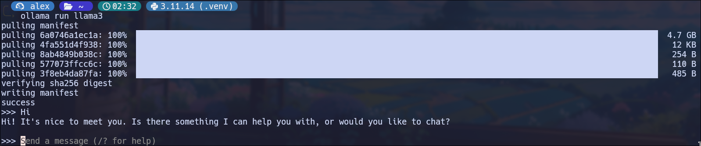
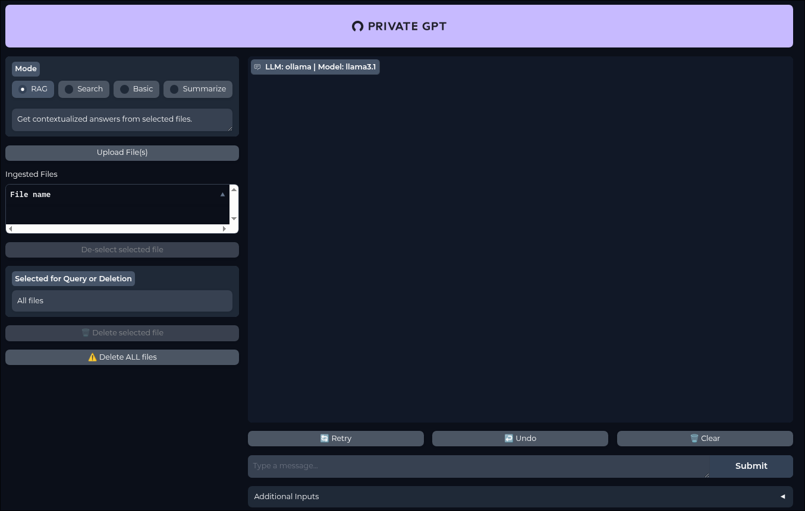

# AI

Host your AI locally!

## Host in TUI with Ollama



### [Download & Install](https://ollama.com/download)

```sh
curl -fsSL https://ollama.com/install.sh | sh
```

### Run Model

Chose your desired model [here](https://ollama.com/search)

```sh
ollama run <model>
```

## Host in GUI with [Private GPT](https://docs.privategpt.dev/quickstart/getting-started/quickstart)



### Requirements

- Poetry
- Python
- [Pyenv](https://github.com/pyenv/pyenv)

### Install

set python environment to 3.11 (Private-GPT runs 3.11):

```sh
pyenv install 3.11
pyenv versions
# * 3.11.14 (set by /home/alex/.pyenv/version)

pyenv global 3.11.14
```

Clone Private-GPT:

```sh
git clone https://github.com/zylon-ai/private-gpt.git
cd private-gpt
```

Install dependencies:

```sh
poetry install
```

or

```sh
poetry install --extras "ui llms-ollama embeddings-ollama vector-stores-qdrant"
```

option 1: standard run in docker compose:

PGPT wants you to run `docker-compose up` command don't do it.
don't run `docker-compose up` up as is the old (deprecated)
instead run this command:

```sh
docker compose up
```

option 2: run a specific profile:

```sh
cat settings-ollama.yaml
```

```sh
PGPT_PROFILES=ollama make run
```

### Debug

Error:

```sh
# Command:
PGPT_PROFILES=ollama make run

# Error:
ModuleNotFoundError: No module named '_sqlite3'
```

Fix:

```sh
# SQLite dev packaged (Fedora):
sudo dnf install -y sqlite sqlite-devel

# Aditional features:
sudo dnf install -y bzip2-devel readline-devel libffi-devel openssl-devel

# Reinstall version:
pyenv uninstall 3.11.14
pyenv install 3.11.14
pyenv global 3.11.14

# Try again:
PGPT_PROFILES=ollama make run
```

## Ollama API

### Examples

specify a model:

```sh
curl http://localhost:11434/api/generate \
  -d '{
    "model": "llama3.1",
    "prompt": "Say hello in one sentence."
  }'
```

for embeddings:

```sh
curl http://localhost:11434/api/embeddings \
  -d '{
    "model": "nomic-embed-text",
    "prompt": "Hello world"
  }'
```


## Alexander AI Stack

### Stack INFO

- Frontend & UI: fetch with JS & display in HTML & CSS
- API: FastAPI
- LLM & embeddings: Ollama
- RAG: LlamaIndex + ChromaDB

[embeddings](https://ollama.com/library/nomic-embed-text)

Tree:

```sh
.
├── backend
│   ├── chroma_db
│   ├── data
│   │   └── about.md
│   └─── main.py
├── cloud_script_install.sh
├── docker-compose.yml
├── Dockerfile
├── hosting.md
├── LICENSE
├── privategpt.service
├── pyproject.toml
└── README.md
```

RUN API:

```sh
uvicorn main:app --reload
```
